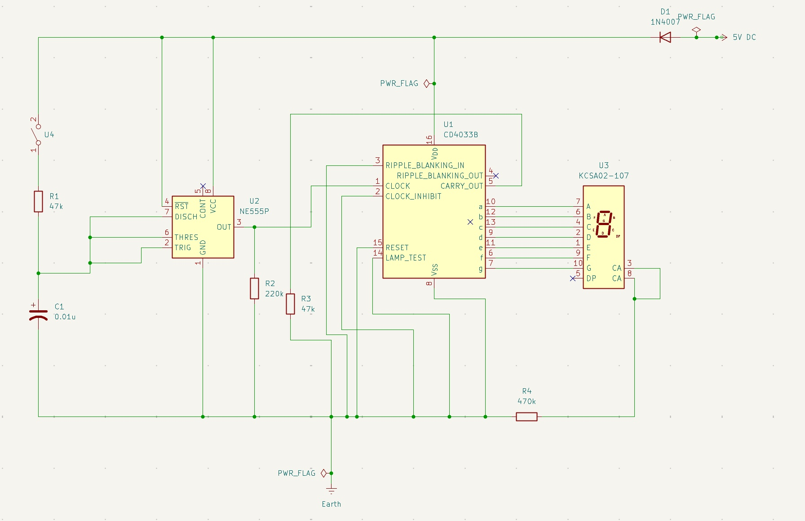
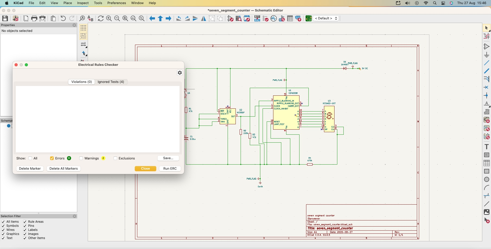

# 7-Segment Digital Counter PCB Design

## Overview

This project involved designing a printed circuit board for a 7-segment digital counter and documenting the process from the initial circuit schematic through to PCB layout and routing.

The project allowed me to develop practical experience with PCB design and understand the workflow involved in turning a digital circuit schematic into a physical PCB.

## Project Workflow

The overall design process was:

1. Circuit schematic
2. Electrical Rules Check (ERC)
3. Component selection
4. Footprint assignment
5. PCB schematic update
6. PCB layout
7. Component placement
8. Trace routing
9. Design Rules Check (DRC)
10. Final PCB design

## 1. Circuit Schematic

The project began with creating the circuit schematic for the 7-segment digital counter and connecting the required components.

This stage helped me understand how the electrical connections between the components of a digital counter are represented before creating the physical PCB.

## 2. Electrical Rules Check (ERC)

After completing the circuit schematic, an Electrical Rules Check (ERC) was performed to check for potential electrical and connection issues.

This helped me understand the importance of checking the circuit schematic for errors before moving on to the PCB design stage.

## 3. Assigning Footprints

After completing the schematic and ERC, footprints were assigned to the components used in the 7-segment digital counter.

I learned that selecting the correct footprint is important because it determines how each physical component will be mounted onto the PCB.

## 4. Updating the PCB

Once the footprints had been assigned, the schematic was updated before transferring the design to the PCB layout.

This gave me a better understanding of how the connections in the digital counter schematic are transferred to the physical PCB design.

## 5. PCB Layout

The components were then positioned on the PCB.

I learned that component placement is important because it affects the routing of traces and the overall organisation of the PCB.

## 6. Routing

The connections between the components were then routed using PCB traces.

This helped me understand how the electrical connections from the 7-segment counter schematic are translated into physical copper traces on the PCB.

## 7. Design Rules Check (DRC)

After completing the PCB layout and routing, a Design Rules Check (DRC) was performed to check for potential issues with the physical PCB design.

This helped me understand the importance of checking the PCB against design rules before finalising the design and identifying potential issues with clearances, connections and other aspects of the layout.

## 8. Final PCB

The final PCB design was then reviewed using the PCB layout and 3D view.

## What I Learned

Through this project, I developed an understanding of the general PCB design workflow, from creating a digital circuit schematic through to producing a routed PCB.

Key things I learned include:

* Creating and interpreting digital circuit schematics
* Performing an Electrical Rules Check (ERC)
* Assigning appropriate component footprints
* Transferring a schematic into a PCB layout
* Positioning components on a PCB
* Routing electrical connections using PCB traces
* Performing a Design Rules Check (DRC)
* Understanding how the connections in a 7-segment counter translate into a physical PCB
* Using PCB design software as part of an electronics design workflow

## Skills Developed

* PCB Design
* Digital Circuit Design
* Circuit Schematics
* Electrical Rules Check (ERC)
* Footprint Assignment
* PCB Layout
* Component Placement
* Trace Routing
* Design Rules Check (DRC)
* Electronic Circuit Design
* Design Documentation
